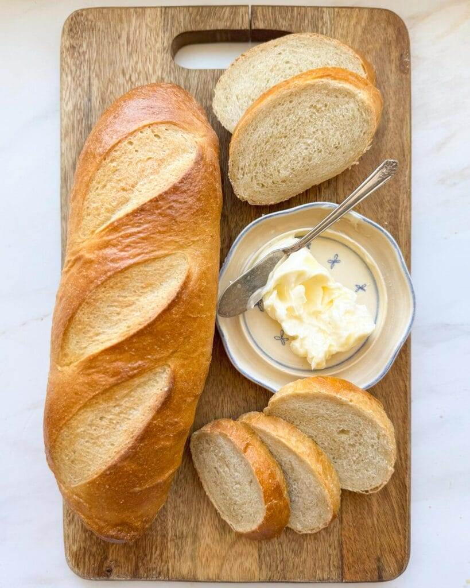
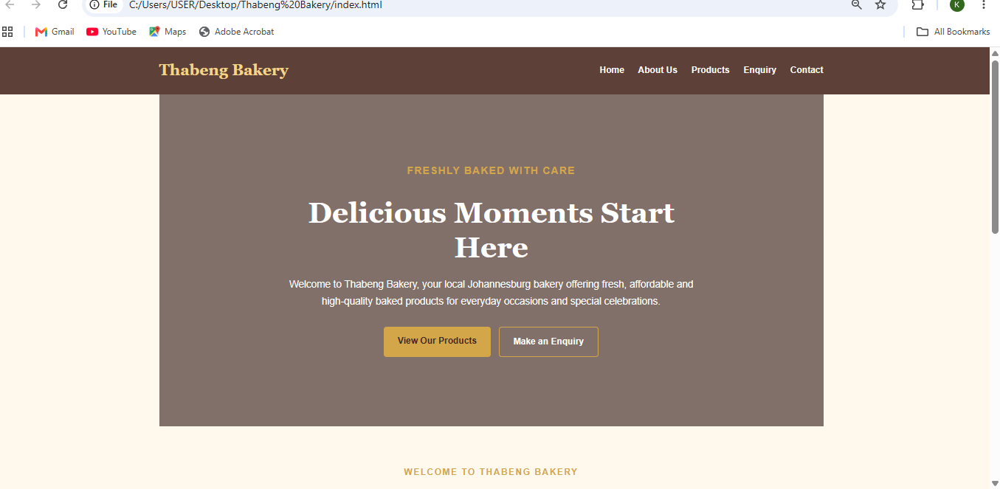
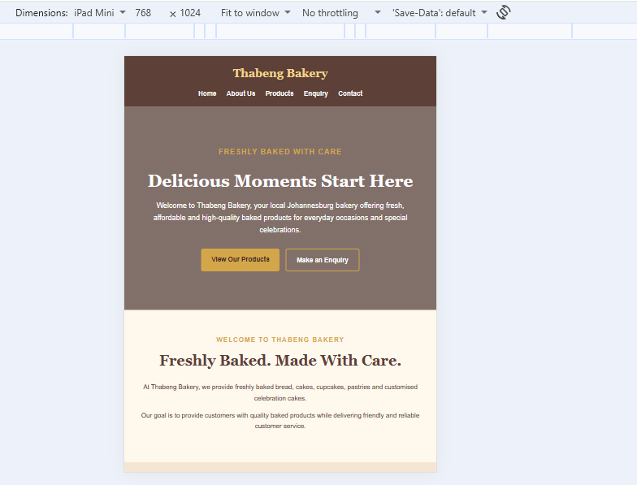
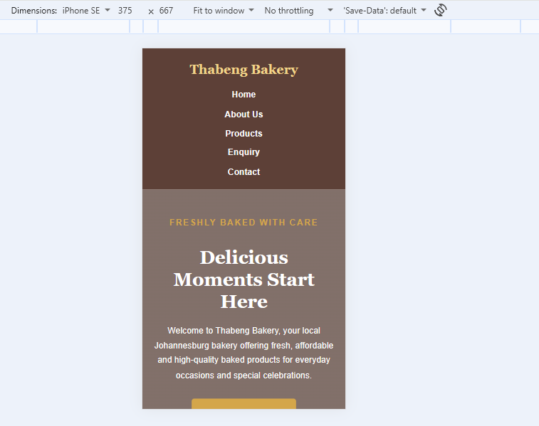

# Thabeng Bakery Website

## WEDE5020 – Web Development

### Student Information

Student Name:  Kamogelo Matseke
Student Number: ST10494978 

---

## 1. Project Overview

Thabeng Bakery is a fictional small bakery based in Johannesburg, South Africa. The website was developed as part of the WEDE5020 Web Development project.

The website provides customers with information about the bakery, its products, custom cake services, enquiry options and contact information.

The project consists of five main pages:

- Home
- About Us
- Products
- Enquiry
- Contact

Part 1 focused on project initiation, planning, content research and the initial HTML website structure. Part 2 focuses on improving the visual appearance of the website using CSS and creating a responsive design suitable for desktop, tablet and mobile devices.

---

## 2. Website Goals and Objectives

The goals of the Thabeng Bakery website are to:

- Establish a professional online presence for the bakery.
- Increase awareness of the bakery and its products.
- Showcase available baked products.
- Allow customers to make product and custom cake enquiries.
- Provide customers with contact information and bakery locations.
- Provide simple and consistent navigation.
- Create a visually appealing user experience.
- Ensure that the website works effectively on desktop, tablet and mobile devices.

### Key Performance Indicators

The success of the website can be measured using:

- Number of website visitors.
- Number of product page views.
- Number of enquiry form submissions.
- Number of customer quotation requests.
- Number of visitors accessing the Contact page.

---

## 3. Key Features and Functionality

The website includes:

- Five interconnected HTML pages.
- Consistent website navigation.
- Hero section and calls to action.
- Bakery product catalogue.
- Product images and pricing information.
- Customer enquiry form.
- Contact form.
- Multiple bakery locations.
- External CSS stylesheet.
- CSS Grid and Flexbox layouts.
- Interactive buttons and navigation links.
- Responsive images.
- Responsive desktop, tablet and mobile layouts.
- Semantic HTML5 structure.
- Accessible form labels and image alternative text.

---

## 4. Sitemap

```text
Thabeng Bakery
│
├── Home
│   └── index.html
│
├── About Us
│   └── about.html
│
├── Products
│   └── products.html
│
├── Enquiry
│   └── enquiry.html
│
└── Contact
    └── contact.html
```

| Page | File | Purpose |
|---|---|---|
| Home | `index.html` | Introduces Thabeng Bakery and provides calls to action |
| About Us | `about.html` | Provides the bakery history, mission and vision |
| Products | `products.html` | Displays bakery products, images and pricing |
| Enquiry | `enquiry.html` | Allows customers to submit product enquiries |
| Contact | `contact.html` | Provides contact information, locations and a contact form |

---

## 5. File and Folder Structure

```text
Thabeng-Bakery/
│
├── index.html
├── about.html
├── products.html
├── enquiry.html
├── contact.html
├── README.md
│
├── css/
│   └── style.css
│
├── js/
│   └── script.js
│
└── images/
    ├── bread.webp
    ├── birthday-cake-11.webp
    ├── cookie-monster-cupcakes.webp
    ├── pastries.webp
    ├── custom-cake.webp
    ├── ass-baked-cakes.webp
    │
    └── testing/
        ├── desktop-view.png
        ├── tablet-view.png
        └── mobile-view.png
```

---

# Part 1 – Building the Foundation

## 6. Part 1 Details

Part 1 focused on the initiation, research, planning and initial implementation of the Thabeng Bakery website.

The following activities were completed:

- Selected a small business as the target organisation.
- Developed website project proposals.
- Selected Thabeng Bakery as the website project.
- Identified the target audience.
- Defined website goals and objectives.
- Researched suitable website content.
- Planned the website structure.
- Developed a sitemap.
- Developed low-fidelity wireframes.
- Established the website file and folder structure.
- Created five HTML pages.
- Added semantic HTML elements.
- Added bakery content and product information.
- Added product images.
- Created navigation links between all five pages.
- Developed enquiry and contact forms.
- Added comments to explain sections of the HTML code.

---

## 7. Part 1 Feedback and Corrections

### Lecturer Feedback

The Part 1 feedback indicated that the submitted work demonstrated good effort in researching and preparing content for the proposed bakery website. The organisation's purpose was understood and suitable website content was produced.

However, the feedback also identified that several required assessment artefacts and planning, design, technical and implementation deliverables were not sufficiently represented in the original submission.

### Corrections Implemented

The project was reviewed before continuing with Part 2.

The following improvements were made:

- Reviewed the website project documentation.
- Ensured that the project proposal and planning information were retained.
- Reviewed the website sitemap.
- Reviewed the low-fidelity wireframes.
- Confirmed that all five required HTML pages were present.
- Corrected the Products page filename to `products.html` to match the navigation links.
- Reviewed the navigation links across the website.
- Confirmed the project file and folder structure.
- Improved technical documentation in the README.
- Documented the Part 1 implementation more clearly.
- Prepared the project for further CSS and responsive-design improvements in Part 2.

---

# Part 2 – Designing the Visuals: CSS Styling and Responsive Design

## 8. External CSS Stylesheet

The website uses an external stylesheet:

`css/style.css`

The stylesheet is linked to the HTML pages using:

```html
<link rel="stylesheet" href="css/style.css">
```

Using an external stylesheet allows the website to maintain a consistent visual design while avoiding unnecessary duplication of CSS code.

---

## 9. Base Styling

A CSS reset is used to reduce browser inconsistencies.

```css
* {
    box-sizing: border-box;
    margin: 0;
    padding: 0;
}
```

Base styling defines the website's:

- Font family.
- Text colour.
- Background colour.
- Line height.
- Spacing.
- Box sizing.

The main colour palette consists of warm bakery-inspired colours including brown, cream and gold.

---

## 10. Typography

Typography was styled using CSS properties including:

- `font-family`
- `font-size`
- `font-weight`
- `line-height`
- `letter-spacing`

Georgia is used for prominent headings while Arial and Helvetica are used for readable body content.

Relative units such as `rem` are also used in the Part 2 responsive enhancements to improve scalability across screen sizes.

---

## 11. Desktop Layout

The desktop version uses both CSS Flexbox and CSS Grid.

### Flexbox

Flexbox is used for:

- Header alignment.
- Navigation.
- Hero buttons.

### CSS Grid

CSS Grid is used for:

- Homepage product highlights.
- Product catalogue.

On larger displays, the product catalogue uses a multi-column layout to make effective use of the available screen space.

---

## 12. Visual Styling

The website uses CSS visual properties including:

- `color`
- `background-color`
- `border`
- `border-radius`
- `box-shadow`
- `transition`
- `transform`

Product cards contain shadows and rounded corners to create visual separation.

Interactive elements use pseudo-classes including:

- `:hover`
- `:focus`
- `:active`

These provide users with visual feedback while navigating and interacting with the website.

---

## 13. Responsive Design

The website follows a responsive design approach so that content adapts to different screen sizes.

### Breakpoints

Two primary responsive breakpoints are used:

| Device Type | Breakpoint | Layout |
|---|---:|---|
| Desktop | Above 900px | Multi-column desktop layout |
| Tablet | 900px and below | Two-column layout |
| Mobile | 600px and below | Single-column layout |

Media queries modify:

- Navigation layout.
- Grid columns.
- Hero height.
- Heading sizes.
- Section spacing.
- Product image dimensions.
- Enquiry form spacing.
- Button positioning.

---

## 14. Relative Units

Relative units are used to improve responsiveness.

Examples include:

- `rem` for typography and spacing.
- `%` for responsive padding and widths.
- `vw` in responsive image sizing information.

This allows website elements to adapt more effectively to different display sizes.

---

## 15. Responsive Images

Product images use the `srcset` and `sizes` attributes.

Example:

```html

```

The `sizes` attribute describes the approximate image display width for mobile, tablet and desktop layouts.

Images also use CSS rules such as:

```css
img {
    max-width: 100%;
    height: auto;
}
```

to prevent images from overflowing their containers.

Lazy loading is applied to product images to avoid unnecessarily loading images further down the page immediately.

---

## 16. Responsive Testing

The website was tested using Google Chrome Developer Tools.

Testing was performed at desktop, tablet and mobile viewport sizes.

### Desktop View

The desktop version uses the full navigation and multi-column content layouts.



### Tablet View

The tablet version was tested at approximately **768 × 1024 pixels**.

The product layout changes to fewer columns and the website content adjusts to the available viewport.



### Mobile View

The mobile version was tested at approximately **375 × 667 pixels**.

Navigation, typography, buttons and content adjust for the smaller viewport, while product grids change to a single-column layout.



### Testing Results

Testing confirmed that:

- Navigation remained accessible.
- Text remained readable.
- Content remained within the viewport.
- Product layouts responded to screen size changes.
- Images remained responsive.
- Buttons remained usable.
- Forms remained accessible.
- No unnecessary horizontal scrolling was observed.

---

## 17. Browser Testing

The website was primarily tested using Google Chrome and Chrome Developer Tools.

HTML structure, links, images, forms and responsive layouts were reviewed during development.

Further cross-browser testing can be performed using Microsoft Edge and Mozilla Firefox to identify browser-specific issues.

---

## 18. Timeline and Milestones

| Milestone | Description | Status |
|---|---|---|
| Project Proposal | Develop website project proposals | Completed |
| Organisation Selection | Select Thabeng Bakery | Completed |
| Content Research | Research website content and assets | Completed |
| Website Planning | Develop sitemap and wireframes | Completed |
| HTML Development | Create five HTML pages | Completed |
| Navigation | Link all pages | Completed |
| Part 1 Feedback Review | Review lecturer feedback and correct project | Completed |
| External CSS | Link and develop `style.css` | Completed |
| Desktop Styling | Apply desktop visual design | Completed |
| Responsive Design | Implement tablet and mobile breakpoints | Completed |
| Responsive Images | Add responsive image attributes | Completed |
| Device Testing | Test desktop, tablet and mobile layouts | Completed |
| README Documentation | Update documentation for Part 2 | Completed |
| GitHub Repository | Commit and push final project | In Progress |

---

# Changelog

## Version 0.1 – Project Foundation

- Created the Thabeng Bakery project.
- Created the initial project folder structure.
- Added the five required HTML pages.
- Added CSS, JavaScript and images folders.
- Created the main website navigation.
- Added initial bakery content.

## Version 0.2 – Website Development

- Developed the Home page.
- Developed the About Us page.
- Developed the Products page.
- Developed the Enquiry page.
- Developed the Contact page.
- Added bakery product images.
- Added enquiry and contact forms.

## Version 0.3 – Part 1 Documentation

- Added the project overview.
- Added website goals and objectives.
- Added sitemap information.
- Added project timeline.
- Added Part 1 details.
- Added project references.

## Version 0.4 – Part 1 Feedback Corrections

**Date: 30 September 2026**

Following lecturer feedback from Part 1:

- Reviewed the missing planning, design, technical and implementation documentation.
- Improved the README to provide clearer project documentation.
- Reviewed the project proposal, sitemap and low-fidelity wireframes.
- Confirmed that the five required HTML pages were included.
- Corrected the Products page filename to `products.html`.
- Reviewed navigation links and website structure.
- Improved documentation of the project's planning and implementation deliverables.
- Prepared the website foundation for Part 2 development.

## Version 0.5 – Part 2 CSS Styling

**Date: 30 September 2026**

- Reviewed the existing external CSS stylesheet.
- Added responsive typography enhancements.
- Added relative `rem` units.
- Improved responsive spacing.
- Improved keyboard focus styling.
- Added active-state styling.
- Maintained CSS Grid and Flexbox desktop layouts.
- Maintained visual styling including shadows, borders and transitions.

## Version 0.6 – Responsive Design

**Date: 30 September 2026**

- Improved tablet styling.
- Improved mobile styling.
- Added responsive image rules.
- Added `srcset` and `sizes` attributes to product images.
- Added lazy loading to product images.
- Tested the website at desktop size.
- Tested the website at 768 × 1024 tablet size.
- Tested the website at approximately 375 × 667 mobile size.
- Added testing screenshots to the project.

## Version 0.7 – Part 2 Documentation

**Date: 30 September 2026**

- Updated README documentation for Part 2.
- Documented the CSS styling approach.
- Documented responsive breakpoints.
- Documented responsive images.
- Added responsive testing evidence.
- Updated project timeline.
- Updated changelog.

---

# References

The following resources were used during the planning, development, testing and validation of the website:

- World Wide Web Consortium (W3C). HTML and Web Standards. Available at: https://www.w3.org/
- W3C. Markup Validation Service. Available at: https://validator.w3.org/
- W3C. CSS Validation Service. Available at: https://jigsaw.w3.org/css-validator/
- MDN Web Docs. CSS. Available at: https://developer.mozilla.org/en-US/docs/Web/CSS
- MDN Web Docs. Responsive Images. Available at: https://developer.mozilla.org/en-US/docs/Learn_web_development/Extensions/Performance/Multimedia
- Visual Studio Code. Documentation. Available at: https://code.visualstudio.com/docs
- GitHub. Documentation. Available at: https://docs.github.com/

---

## Project Status

**WEDE5020 Part 1:** Completed and reviewed following lecturer feedback.  
**WEDE5020 Part 2:** CSS styling and responsive design implemented and tested.